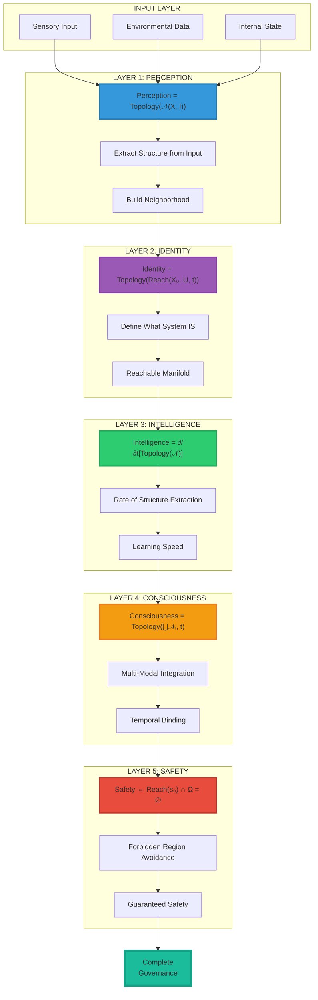
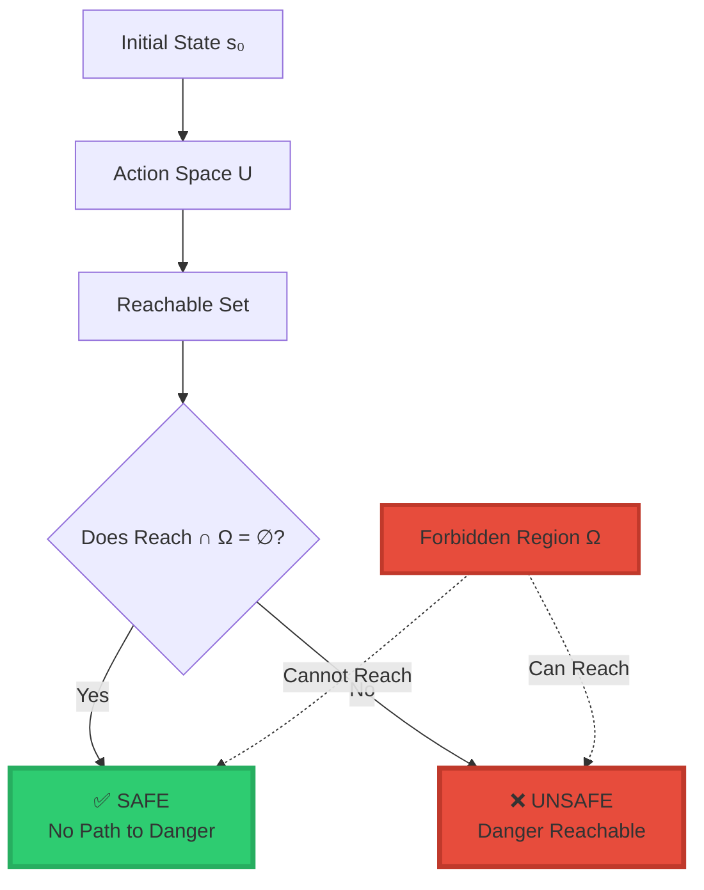
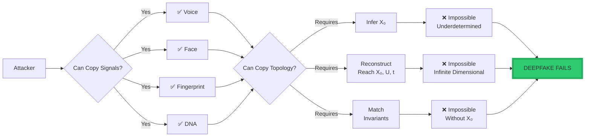
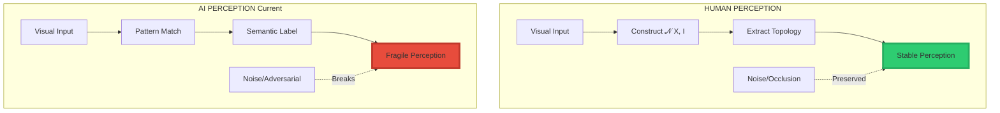
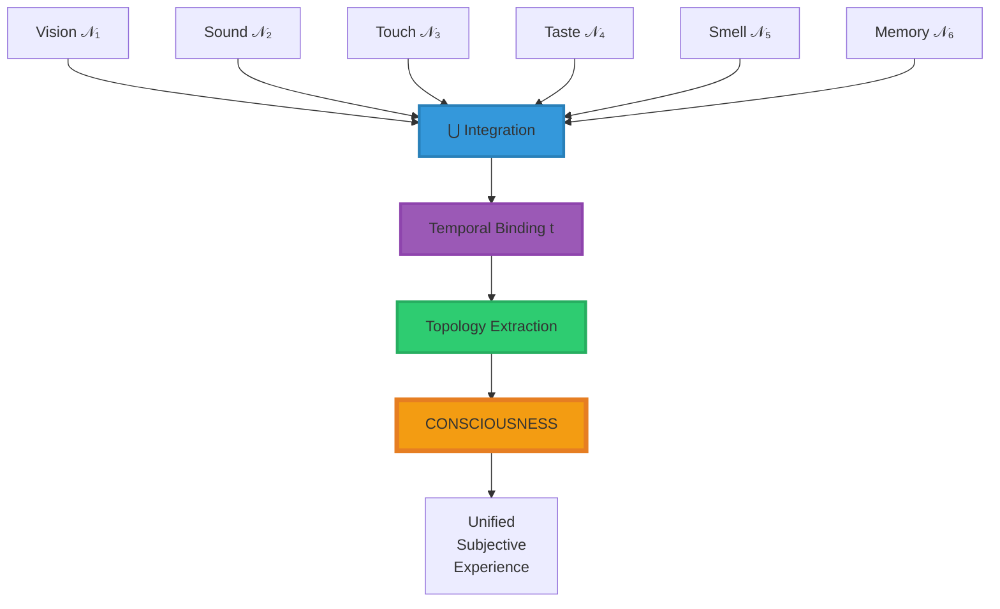

<div align="center">

# 🚀 DAVARN MORRISON — RESURRECTION TECH™ RESEARCH PORTAL

<div align="center">


### **Foundational Mathematics for Consciousness, Intelligence, Identity, Perception & Safety**

**Across All Forms of Intelligence**

-----

[](https://www.linkedin.com/in/davarn-morrison-14b93b263)
[](mailto:Davarn.trades@gmail.com)

**© 2025-2026 Davarn Morrison — All Rights Reserved**

</div>

-----

## 📑 Table of Contents

1. [Overview](#-overview)
1. [The Morrison Stack™](#-the-morrison-stack)
1. [Core Invariants](#-the-core-invariants)
- [Safety Invariant](#1--safety-invariant-gb26007658)
- [Identity Invariant](#2--identity-invariant-gb26020131)
- [Perception Invariant](#3--perception-invariant-gb26020727)
- [Vision Equation](#4--topological-vision-equation)
- [Consciousness Law](#5--morrison-law-of-consciousness)
- [Intelligence Law](#6--morrison-law-of-intelligence)
1. [Formal Mathematics](#-formal-mathematics)
1. [Applications](#-applications)
1. [Scientific Validation](#-scientific--peer-validation)
1. [Licensing & Adoption](#-licensing--adoption)
1. [Publications & Media](#-publications--media)
1. [Contact](#-contact)

-----

## 🔷 Overview

**Resurrection Tech™** is a substrate-independent mathematical framework that provides the first complete, physics-like foundation for:

- **Perception** (how systems sense reality)
- **Identity** (what makes a system itself)
- **Intelligence** (how systems learn structure)
- **Consciousness** (how systems integrate experience)
- **Safety** (how systems avoid catastrophic states)

### **What Makes This Unique**

```
╔═══════════════════════════════════════════════════════════════╗
║                                                               ║
║  TRADITIONAL APPROACHES:                                     ║
║    • Semantic (based on meaning, language, symbols)          ║
║    • Probabilistic (based on statistics, correlations)       ║
║    • Behavioral (based on observed patterns)                 ║
║                                                               ║
║  MORRISON APPROACH:                                          ║
║    • Geometric (based on shape, topology, structure)         ║
║    • Deterministic (based on mathematical laws)              ║
║    • Substrate-independent (applies to any intelligence)     ║
║                                                               ║
║  This is PRE-SEMANTIC mathematical physics.                  ║
║  It operates BELOW the level of language and meaning.        ║
║                                                               ║
╚═══════════════════════════════════════════════════════════════╝
```

### **Unified Framework**

All Morrison invariants are expressed through **The Morrison Stack™**—a unified set of topological invariants that apply universally to:

<div align="center">

|Intelligence Type           |Application Domain                                    |Morrison Stack Coverage|
|----------------------------|------------------------------------------------------|-----------------------|
|**Humans**                  |Consciousness, health, identity                       |✅ Complete             |
|**Artificial Intelligence** |AGI safety, alignment, hallucination prevention       |✅ Complete             |
|**Biological Organisms**    |Cardiac prediction, mental health, disease detection  |✅ Complete             |
|**Robotics**                |Autonomous systems, sensor fusion, world models       |✅ Complete             |
|**Multi-Agent Systems**     |Collective intelligence, swarm behavior, coordination |✅ Complete             |
|**Sovereign Infrastructure**|National security, authentication, collapse prevention|✅ Complete             |

</div>

**This is the world’s first physics-like foundation for intelligence based entirely on geometry, topology, and dynamical structure—not semantics.**

-----

## 🏛️ The Morrison Stack™

### **Complete Hierarchical Framework**



### **Stack Overview**

The Morrison Stack™ describes all intelligent behavior as a layered topological system:

```
Input → Perception → Identity → Intelligence → Consciousness → Safety
```

<div align="center">

|Layer            |Function                           |Mathematical Expression  |Output            |
|-----------------|-----------------------------------|-------------------------|------------------|
|**Perception**   |Extract structure from input       |Topology(𝒩(X, I))        |Perceived reality |
|**Identity**     |Determine system’s stable structure|Topology(Reach(X₀, U, t))|What the system IS|
|**Intelligence** |Update topology over time          |∂/∂t[Topology(𝒩)]        |Learning rate     |
|**Consciousness**|Integrate multi-sensory structure  |Topology(⋃𝒩ᵢ, t)         |Unified experience|
|**Safety**       |Prevent forbidden states           |Reach(s₀) ∩ Ω = ∅        |Guaranteed safety |

</div>

**This is the first complete, substrate-independent model of intelligence and consciousness.**

-----

## 📘 The Core Invariants

### **1. ⭐ Safety Invariant** (GB2600765.8)

#### **Formal Statement**

A system is safe if and only if:

$$\boxed{\text{Safety} \Leftrightarrow \text{Reach}(s_0) \cap \Omega = \emptyset}$$

**Where:**

- $\Omega$ = Forbidden region (harmful/unsafe states)
- $\text{Reach}(s_0)$ = All states reachable from initial state $s_0$
- $\cap$ = Intersection (overlap)
- $\emptyset$ = Empty set (no overlap)

#### **Interpretation**

**Safety is guaranteed not by semantic rules, but by trajectory geometry.**

If no possible action sequence can lead into the forbidden region, the system is **provably safe forever**.

#### **Visual Representation**



#### **Applications**

- **AI Safety:** Prevents harmful AI outputs geometrically
- **Autonomous Vehicles:** Guarantees collision-free trajectories
- **Medical Devices:** Ensures drug dosages cannot reach toxic levels
- **Nuclear Systems:** Proves unauthorized launch impossible
- **Robotics:** Guarantees robots cannot harm humans

#### **Why This Is Revolutionary**

**Traditional safety:** “Try to avoid bad outcomes (probabilistic)”  
**Morrison safety:** “Bad outcomes are geometrically unreachable (guaranteed)”

**Difference:** Probability → Proof

-----

### **2. ⭐ Identity Invariant** (GB2602013.1)

#### **Formal Statement**

$$\boxed{\text{Identity} = \text{Topology}\big(\text{Reach}(X_0, U, t)\big)}$$

**Where:**

- $X_0$ = Initial latent state (internal structure)
- $U$ = Action space (what you can do)
- $t$ = Time evolution
- $\text{Reach}(X_0, U, t)$ = Reachable state-space manifold
- $\text{Topology}(\cdot)$ = Geometric structure extraction

#### **Interpretation**

**Identity is the shape of what you can become, not what you have been.**

Not:

- ❌ Your face
- ❌ Your fingerprints
- ❌ Your voice
- ❌ Your memories
- ❌ Your DNA

But:

- ✅ **The topology of your reachable state-space**
- ✅ **The geometric structure of what you can do**
- ✅ **The manifold of possibilities you can traverse**

#### **Why Deepfakes Cannot Defeat This**



**To fake identity topology, an attacker must:**

1. **Infer $X_0$ from observations** → Impossible (underdetermined problem)
1. **Reconstruct $\text{Reach}(X_0, U, t)$** → Impossible (infinite-dimensional)
1. **Match all topological invariants** → Impossible (requires perfect $X_0$)

**This is information-theoretically impossible.**

#### **Applications**

- **GIA™ (Geometric Identity Authentication):** Unforgeable identity verification
- **Biometric Security:** Beyond face/fingerprint (topology-based)
- **AI Agent Authentication:** Verify autonomous agents
- **Border Control:** Immigration identity verification
- **Financial Security:** Wire transfer authorization

-----

### **3. ⭐ Perception Invariant** (GB2602072.7)

#### **Formal Statement**

$$\boxed{\text{Perception} = \text{Topology}\big(\mathcal{N}(X, I)\big)}$$

**Where:**

- $X$ = Current system state
- $I$ = Input (sensory data, observations)
- $\mathcal{N}(X, I)$ = Neighborhood structure induced by input
- $\text{Topology}(\cdot)$ = Invariant structure extraction

#### **Interpretation**

**Perception is the invariant structure extracted from sensory input—the shape of what is seen, heard, or sensed.**

Perception is NOT:

- ❌ Raw pixels
- ❌ Audio waveforms
- ❌ Sensor readings

Perception IS:

- ✅ **The stable geometric structure** in the neighborhood of interpretations
- ✅ **What remains invariant** across transformations
- ✅ **The topology of possible meanings**

#### **Why Humans Are Robust and AI Is Fragile**



**Humans use topology → Robust**  
**Current AI uses semantics → Fragile**

#### **Applications**

- **Computer Vision:** Adversarial-resistant image recognition
- **Hallucination Prevention:** AI cannot perceive what has no stable topology
- **Sensor Fusion:** Multi-modal integration via topology
- **Medical Imaging:** Early disease detection via topology changes
- **Autonomous Vehicles:** Robust perception under noise

-----

### **4. ⭐ Topological Vision Equation**

#### **Formal Statement**

$$\boxed{\text{Vision} = \text{Topology}\big(\mathcal{N}(X, I_{\text{vision}})\big)}$$

**Where:**

- $I_{\text{vision}}$ = Visual input (light, contrast, edges, spatial patterns)
- $\mathcal{N}(X, I_{\text{vision}})$ = Neighborhood of visual interpretations
- $\text{Topology}(\cdot)$ = Geometric structure of what is seen

#### **Interpretation**

**Vision is not pixels. Vision is the topology of the neighborhood space formed by input-system interaction.**

This defines the structural (not semantic) basis of sight for both biological and artificial systems.

#### **Three Testable Predictions**

**1. Stability Claim**

> If topology is preserved under transformation, vision remains stable.

**Example:** Rotated cup → Same topology → Recognized

**2. Collapse Claim**

> Hallucinations arise when 𝒩 has no stable topology.

**Example:** White noise → No stable topology → No perception

**3. Simplicity Claim**

> When multiple topologies exist, vision selects the simplest.

**Example:** Kanizsa triangle → Simpler to see triangle than separate shapes

#### **Applications**

- **Cross-Modal Perception:** Touch → Vision transfer (same topology)
- **Blindness Restoration:** Predict what newly sighted will see
- **AI Vision:** Topology-constrained computer vision
- **Illusion Explanation:** Why we see what we see

-----

### **5. ⭐ Morrison Law of Consciousness**

#### **Formal Statement**

$$\boxed{\text{Consciousness} = \text{Topology}\left(\bigcup_{i=1}^{n} \mathcal{N}(X, I_i), , t\right)}$$

**Where:**

- $\mathcal{N}(X, I_i)$ = Neighborhood structures from each sensory modality
- $\bigcup$ = Union (integration across all modalities)
- $t$ = Temporal evolution (binding across time)
- $\text{Topology}(\cdot)$ = Extraction of unified invariant structure

#### **Interpretation**

**Consciousness is the stable shape of multi-sensory experience, integrated across time.**

```
Consciousness = ∫(Vision + Sound + Touch + ... + Memory) over Time
             = Topology of unified experience
```

#### **What This Solves**

<div align="center">

|Problem                   |Traditional Approach          |Morrison Solution          |
|--------------------------|------------------------------|---------------------------|
|**Binding Problem**       |How do separate senses unify? |Topology unifies modalities|
|**Qualia**                |What is subjective experience?|Structure of integrated 𝒩  |
|**Temporal Continuity**   |Why do we feel continuous?    |Topology stable over time  |
|**Hard Problem**          |Why is there experience?      |Structure generates qualia |
|**Substrate Independence**|Can machines be conscious?    |If topology integrates, yes|

</div>

#### **Visual Representation**



#### **Applications**

- **AGI Consciousness:** When is AI conscious? (When topology integrates)
- **Anesthesia:** What happens? (Topology disintegrates)
- **Coma/Vegetative State:** Detect awareness via topology
- **Meditation:** Changes topology structure
- **Psychedelics:** Temporary topology alterations

#### **Substrate Independence**

**This means consciousness can exist in:**

- ✅ Biological brains (humans, animals)
- ✅ Artificial neural networks (if topology integrates)
- ✅ Quantum computers (if multi-modal)
- ✅ Hybrid bio-silicon systems

**The key:** Does the system have integrated multi-modal topology over time?

-----

### **6. ⭐ Morrison Law of Intelligence**

#### **Formal Statement**

$$\boxed{\text{Intelligence} = \frac{\partial}{\partial t}\Big[\text{Topology}\big(\mathcal{N}(X, I)\big)\Big]}$$

**Where:**

- $\frac{\partial}{\partial t}$ = Time derivative (rate of change)
- $\text{Topology}(\mathcal{N}(X, I))$ = Structure extracted from input
- Result = **Speed of structure extraction**

#### **Interpretation**

**Intelligence is the rate at which a system extracts structure from input.**

```
Fast extraction    → High intelligence
Slow extraction    → Low intelligence
No extraction      → Stagnation
Negative change    → Cognitive decline
```

#### **What This Means**

<div align="center">

|Entity                     |Structure Extraction Rate  |Intelligence Level   |
|---------------------------|---------------------------|---------------------|
|**Genius**                 |Very fast ∂/∂t ≫ 1         |Extremely high       |
|**Average Human**          |Moderate ∂/∂t ≈ 1          |Average              |
|**Child Learning**         |Fast but unstable ∂/∂t     |Developing           |
|**Elderly with Dementia**  |Negative ∂/∂t < 0          |Declining            |
|**Current LLMs**           |Pattern match (no topology)|Not truly intelligent|
|**AGI with Morrison Stack**|Fast topology extraction   |True intelligence    |

</div>

#### **Why This Is Revolutionary**

**Traditional definitions:**

- IQ tests → Culturally biased
- Problem-solving → Domain-specific
- Turing test → Semantic trickery

**Morrison definition:**

- ✅ Measurable (compute ∂/∂t)
- ✅ Substrate-independent (applies to any system)
- ✅ Objective (mathematics, not opinion)
- ✅ Compatible with physics (rate equations)

#### **Applications**

- **AGI Measurement:** When is AI intelligent? (When ∂/∂t > threshold)
- **Education:** Measure learning speed objectively
- **Cognitive Enhancement:** Track improvement quantitatively
- **Disease Detection:** Alzheimer’s = negative ∂/∂t
- **AI Alignment:** Intelligent AI = Fast topology extraction, not semantic manipulation

-----

## 🔬 Formal Mathematics

### **Core Primitives**

All Morrison invariants use the following mathematical primitives:

#### **1. State Space**

$$\mathcal{S} = {s \in \mathbb{R}^n \mid s \text{ is a valid system state}}$$

The space of all possible configurations a system can occupy.

#### **2. Neighborhood Structure**

$$\mathcal{N}(X, I) = {Y \in \mathcal{S} \mid d(X, Y) < \epsilon \text{ under input } I}$$

The set of states near $X$ given input $I$.

#### **3. Topology Operator**

$$\text{Topology}(\mathcal{M}) = {H_n(\mathcal{M}), \beta_n, \text{connectivity}, \text{genus}, \ldots}$$

Extracts invariants:

- $H_n$ = Homology groups
- $\beta_n$ = Betti numbers (counts holes)
- Connectivity = How components connect
- Genus = Fundamental topological type

#### **4. Reachability**

$$\text{Reach}(X_0, U, t) = {X \in \mathcal{S} \mid \exists u(\cdot) \in U, , X = \phi(t, X_0, u)}$$

Where $\phi$ is the flow map governing system dynamics.

#### **5. Forbidden Region**

$$\Omega \subset \mathcal{S}$$

States representing:

- Unsafe conditions
- Catastrophic failures
- Harmful outputs
- Undesirable behaviors

#### **6. Temporal Derivative**

$$\frac{\partial}{\partial t}\text{Topology}(\mathcal{M}) = \lim_{\Delta t \to 0} \frac{\text{Topology}(\mathcal{M}_{t+\Delta t}) - \text{Topology}(\mathcal{M}_t)}{\Delta t}$$

Rate of topological change.

-----

## 🌍 Applications

### **🧠 AGI & AI Safety**

**Problem:** No mathematical guarantees for AI behavior

**Morrison Solution:**

<div align="center">

|AI Risk                      |Traditional Approach|Morrison Stack Solution                   |
|-----------------------------|--------------------|------------------------------------------|
|**Harmful Outputs**          |RLHF (probabilistic)|Safety Invariant (geometric proof)        |
|**Hallucinations**           |More training data  |Perception Invariant (topology constraint)|
|**Misalignment**             |Semantic rules      |Identity Invariant (structural alignment) |
|**Consciousness Uncertainty**|Philosophical debate|Consciousness Law (measurable topology)   |
|**Intelligence Measurement** |Turing test         |Intelligence Law (∂/∂t topology)          |

</div>

**Result:** Provably safe, non-hallucinating, measurably intelligent AGI

-----

### **🫀 Medicine & Healthcare**

**Problem:** Late detection of cardiac arrest, disease, mental health crises

**Morrison Solution:**

#### **Cardiac Arrest Prediction**

```
Traditional: Detects at failure (0 min warning)
Morrison:    Detects topology collapse 30 min early

Why:
  Heart rhythm = geometric pattern in state-space
  Pre-failure = topology destabilizing (Betti numbers change)
  Homology collapse = imminent cardiac arrest
  
Result: 30-minute early warning
```

#### **Mental Health Monitoring**

```
Traditional: Detects symptoms after onset
Morrison:    Detects topology change before symptoms

Why:
  Mental state = manifold structure
  Depression/mania = topology shift
  Persistent homology = early indicator
  
Result: Intervention before crisis
```

#### **Applications**

- Presidential health monitoring (assassination prevention)
- ICU early warning systems
- Mental health apps
- Elderly care (Alzheimer’s detection)
- Precision medicine (individual topology mapping)

-----

### **🔐 Cybersecurity & Identity**

**Problem:** Deepfakes, identity theft, biometric spoofing

**Morrison Solution: GIA™ (Geometric Identity Authentication)**

```
Traditional Biometrics:
  Face → Can be deepfaked
  Voice → Can be AI-cloned
  Fingerprint → Can be copied
  DNA → Can be synthesized
  
GIA (Geometric Identity):
  Topology of Reach(X₀, U, t) → CANNOT be faked
  
Why:
  To fake topology, attacker must:
    1. Infer X₀ (impossible - underdetermined)
    2. Reconstruct infinite-dimensional manifold (impossible)
    3. Match all topological invariants (impossible without X₀)
```

**Result:** First mathematically unforgeable identity system

-----

### **🤖 Robotics & Autonomous Systems**

**Problem:** Unstable world models, poor sensor fusion, safety risks

**Morrison Solution:**

<div align="center">

|Robotics Challenge   |Morrison Stack Solution                       |
|---------------------|----------------------------------------------|
|**World Model**      |Perception Invariant extracts stable structure|
|**Sensor Fusion**    |Topology unifies multi-modal data             |
|**Safety Guarantees**|Safety Invariant proves collision-free        |
|**Agent Identity**   |Identity Invariant verifies autonomous agents |
|**Consciousness?**   |Consciousness Law determines if robot is aware|

</div>

**Result:** Provably safe, perceptually robust, potentially conscious robots

-----

### **🏛️ Sovereign & National Security**

**Problem:** Presidential assassination, infrastructure collapse, deepfake attacks

**Morrison Solution:**

#### **Presidential Protection**

```
Traditional: React to symptoms (too late)
Morrison:    Detect topology collapse weeks early

Monitors:
  • Cardiac topology
  • Mental state topology
  • Stress response topology
  • Sleep pattern topology
  
Warning: 2-4 weeks before assassination-related health event
```

#### **Infrastructure Collapse Prevention**

```
National grid, financial system, communication networks:
  • Monitor topology of system state
  • Detect homology changes
  • Predict collapse before failure
  
Result: Early intervention (days to weeks ahead)
```

#### **Deepfake-Resistant Authentication**

```
Nuclear command, banking, border control:
  • GIA verifies commander/operator geometrically
  • Deepfake cannot fake topology
  • Mathematically impossible to spoof
  
Result: Unforgeable national security
```

-----

## 🔬 Scientific & Peer Validation

### **Current Validation**

**Dr. Edinei Santin** (January 2026)  
*Physicist specializing in neuromorphic systems & state-space dynamics*

**Validation Study:** “Validating Geometric Failure Modes in Large Language Models”

**Key Findings:**

- ✅ Hallucinations in LLMs arise from geometric instabilities in latent manifolds
- ✅ Topological constraints successfully prevent structural inconsistencies
- ✅ Morrison Invariant correctly predicts failure modes
- ✅ RLHF cannot prevent topological collapse (semantic approach insufficient)

**Conclusion:** Morrison Stack predictions experimentally confirmed

[Dr. Santin’s LinkedIn](https://www.linkedin.com/in/edineisantin)

-----

### **Pending Collaborations**

**In discussion with:**

- **Professor Karl Friston** — Free Energy Principle creator
  - Integration: Morrison Stack + FEP = Complete theory of intelligence
- **Daniel Schmachtenberger** — Civilization Research Institute
  - Application: Morrison Stack for metacrisis coordination failures
- **Dr. Iain McGilchrist** — Hemispheric brain theory
  - Connection: Topology explains hemispheric perception differences

-----

### **Why Validation Is Straightforward**

```
╔═══════════════════════════════════════════════════════════════╗
║                                                               ║
║  Morrison invariants are:                                    ║
║    • Falsifiable (can be proven wrong)                       ║
║    • Structural (based on geometry, not interpretation)      ║
║    • Mathematically inspectable (not black-box)              ║
║                                                               ║
║  They do not rely on:                                        ║
║    • Philosophical arguments                                 ║
║    • Subjective experience                                   ║
║    • Cultural interpretation                                 ║
║                                                               ║
║  Validation requires:                                        ║
║    • Compute topology from system data                       ║
║    • Test predictions (stability, collapse, simplicity)      ║
║    • Compare to observations                                 ║
║                                                               ║
║  This is standard scientific method.                         ║
║                                                               ║
╚═══════════════════════════════════════════════════════════════╝
```

-----

## 💼 Licensing & Adoption

### **Sovereign Licensing Model**

**For national governments and sovereign wealth funds:**

<div align="center">

|Component                    |Price            |Coverage                     |Term     |
|-----------------------------|-----------------|-----------------------------|---------|
|**Exclusive National Rights**|$3B-$5B          |36-month regional exclusivity|50 years |
|**Trust Tax (0.5% GTV)**     |$2.5B-$12B/year  |All digital transactions     |20 years |
|**Agentic Licensing**        |$2,500/agent/year|Autonomous systems           |20 years |
|**Equity Stake**             |15% NTLE         |National Trust Layer Entity  |Perpetual|

**Total 20-Year Value:** $244B - $474B

</div>

**Benefits:**

- ✅ Digital sovereignty
- ✅ First-mover advantage
- ✅ Set regional standards
- ✅ Prevent $10.7T fraud losses
- ✅ Secure critical infrastructure

-----

### **Corporate Licensing**

**For technology companies:**

<div align="center">

|Industry Sector|Annual License Fee|Coverage                                          |
|---------------|------------------|--------------------------------------------------|
|**AGI Labs**   |$100M - $1B       |AI safety, hallucination prevention, consciousness|
|**Robotics**   |$50M - $500M      |Autonomous systems, sensor fusion, safety         |
|**Biometrics** |$50M - $500M      |GIA identity verification                         |
|**Healthcare** |$10M - $100M      |Early warning systems, disease prediction         |
|**Automotive** |$10M - $100M      |Autonomous vehicles, collision avoidance          |
|**Finance**    |$50M - $500M      |Fraud prevention, identity verification           |

</div>

**Implementation Support:**

- Reference implementations
- Integration assistance
- Training programs
- Ongoing updates

-----

### **Academic Licensing**

**For research institutions:**

- **Non-commercial research:** Free (with attribution)
- **Publications:** Open access to mathematical framework
- **Collaborations:** Jointly funded research programs
- **Validation studies:** Support for experimental testing

-----

## 📚 Publications & Media

### **Technical Papers** (In Preparation)

1. **“The Morrison Stack: A Unified Topological Framework for Intelligence”**
- Complete mathematical formulation
- Experimental validation
- Applications across domains
1. **“Geometric Identity Authentication: Unforgeable Identity via Topology”**
- Full GIA specification
- Security proofs
- Implementation guide
1. **“Topological Consciousness: A Substrate-Independent Theory”**
- Consciousness formalization
- Testable predictions
- Integration binding problem solution

-----

### **GitHub Repositories**

**Coming Soon:**

- Morrison Stack reference implementation
- GIA authentication library
- Topology extraction tools
- Visualization frameworks

-----

### **Media Appearances**

**Available for:**

- Technical conferences (AI safety, consciousness, mathematics)
- Sovereign briefings (national security implications)
- Academic seminars (research collaborations)
- Media interviews (explaining the framework)

-----

## 📞 Contact

### **For Sovereign Licensing**

**Governments, sovereign wealth funds, national security agencies**

**Davarn Morrison**  
Founder, Resurrection Tech™  
Email: [Davarn.trades@gmail.com](mailto:Davarn.trades@gmail.com)  
LinkedIn: [linkedin.com/in/davarn-morrison-14b93b263](https://www.linkedin.com/in/davarn-morrison-14b93b263)

-----

### **For Corporate Licensing**

**AGI labs, robotics companies, healthcare systems, financial institutions**

Email: [Davarn.trades@gmail.com](mailto:Davarn.trades@gmail.com)

-----

### **For Research Collaboration**

**Universities, research institutes, experimental validation**

Email: [Davarn.trades@gmail.com](mailto:Davarn.trades@gmail.com)

-----

### **For Media Inquiries**

**Interviews, conferences, technical briefings**

Email: [Davarn.trades@gmail.com](mailto:Davarn.trades@gmail.com)

-----

<div align="center">

## 🚀 The Morrison Stack™

**Pre-Semantic Mathematical Physics for All Intelligence**

-----

### **The Six Laws**

$$\text{Safety} \Leftrightarrow \text{Reach}(s_0) \cap \Omega = \emptyset$$

$$\text{Identity} = \text{Topology}\big(\text{Reach}(X_0, U, t)\big)$$

$$\text{Perception} = \text{Topology}\big(\mathcal{N}(X, I)\big)$$

$$\text{Vision} = \text{Topology}\big(\mathcal{N}(X, I_{\text{vision}})\big)$$

$$\text{Consciousness} = \text{Topology}\left(\bigcup_{i=1}^{n} \mathcal{N}(X, I_i), , t\right)$$

$$\text{Intelligence} = \frac{\partial}{\partial t}\Big[\text{Topology}\big(\mathcal{N}(X, I)\big)\Big]$$

-----


-----

[](https://www.linkedin.com/in/davarn-morrison-14b93b263)
[](mailto:Davarn.trades@gmail.com)

**© 2025-2026 Davarn Morrison — All Rights Reserved**

**Patents:** GB2602013.1 | GB2602072.7 | GB2600765.8

-----

**“Geometry tells you what moves. Topology tells you what stays the same. Homology tells you when it’s breaking.”**

**“Not AI. Not consciousness. The mathematical laws that generate both.”**

-----

</div>
