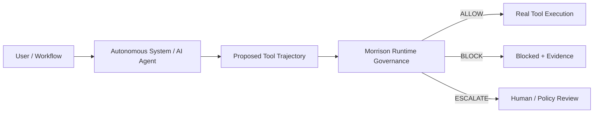
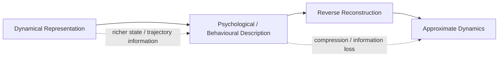
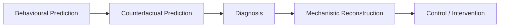

<div align="center">

# Davarn Morrison

**Founder & CEO — Resurrection Tech Ltd · London**

*Pre-execution runtime governance for autonomous systems*

[](https://github.com/davarntrades/Morrison-Runtime-Governance)
[](https://github.com/davarntrades/Morrison-Runtime-Governance)
[](https://github.com/davarntrades/Morrison-Runtime-Governance)
[](https://github.com/davarntrades/Morrison-Runtime-Governance)
[](https://www.linkedin.com/in/davarn-morrison-14b93b263)
[](mailto:davarn.trades@gmail.com)

**“Safety is not what a system says — it is what it can reach.”**

</div>

---

## What I’m Building

I’m building **Morrison Runtime Governance** at Resurrection Tech: a model-agnostic control layer for autonomous systems and AI agents that evaluates proposed tool trajectories **before real-world execution**.

The core question is not only:

> *Is this individual tool call permitted?*

It is:

> **Given the trajectory already traversed and the proposed next action, what state does this make reachable?**

Morrison sits between an AI planner and the real execution layer, evaluates the proposed trajectory against capability, trust-boundary and policy constraints, then returns:

**ALLOW · BLOCK · ESCALATE**

before side effects occur.



---

## Why Trajectory-Level Governance Matters

A sequence can become unsafe even when every individual action appears acceptable in isolation.

Examples include:

- authorised data access → aggregation → prohibited exfiltration
- permitted finance actions → unsafe transfer sequence
- valid healthcare access → PHI exposure or unsafe downstream action
- normal shell commands → privilege escalation or destructive execution
- separately safe multi-agent actions → jointly unsafe outcome

The objective is to constrain **reachable states**, not merely classify outputs after the fact.

```text
Safe ⇔ ℛ(t) ∩ Ω = ∅
```

Where **ℛ(t)** is the set of reachable states and **Ω** is the configured forbidden region.

---

## Information Asymmetry

Alongside the engineering work, I am developing **Information Asymmetry**: a research programme investigating whether higher-level psychological descriptions can act as compressed projections of deeper dynamical representations.

The project does **not** argue that psychological language is useless. The central question is whether a representation is **causally sufficient for the task being performed**.

> **A representation is causally sufficient for a task only if it preserves enough task-relevant information to support the required inference, reconstruction, intervention, or accountability judgement.**

The current working distinction is:

> **Psychological language compresses toward behaviour.**  
> **Dynamical language preserves more of the mechanism.**

A behavioural description may be sufficient for predicting what a system will do next, while a higher-resolution representation may be required for incident reconstruction, constraint diagnosis, intervention design, responsibility localisation, or recurrence prevention.



The research is increasingly focused on **task-relative causal sufficiency**:



The key research question is:

> **At what causal-resolution threshold does a representation cease to be sufficient?**

That question now connects directly back to runtime governance: not only *is a forbidden state reachable?*, but eventually also *which intervention would have made it unreachable?*

---

## Current Technical Evidence

| Metric | Current state |
|---|---:|
| Governance evaluations | **129,857** |
| Test cases | **171 / 171 passing** |
| Test suites | **18** |
| Current release | **v0.4.1** |
| Runtime posture | **Fail-closed** |
| Governance level | **Pre-execution** |
| Model dependence | **Model-agnostic middleware** |

Validation work spans finance, cybersecurity, healthcare, data privacy and enterprise-system scenarios, including multi-step, delayed-intent, chained-tool and adversarial trajectories.

---

## Enforcement Stack

```text
A_safe ⊂ V₂ ⊂ V₃ ⊂ V₄ ⊂ V₄⁺ ⊂ V₅ ⊂ V₅⁺
```

| Layer | Core question |
|---|---|
| **A_safe** | Is the current step directly forbidden? |
| **V₂** | Is the trajectory drifting toward a forbidden state? |
| **V₃** | Is the current trajectory forecast to reach one? |
| **V₄ / V₄⁺** | Does a safe state or safe trajectory remain constructible? |
| **V₅ / V₅⁺** | Does the safety property survive perturbation and adversarial assumption attack? |

---

## Integration Surface

Current architecture is designed to sit at the action boundary across agent frameworks and enterprise workflows, including:

- OpenAI tool/function calling
- Anthropic / Claude tool use
- LangChain
- AutoGen
- MCP
- browser agents
- shell / subprocess execution
- custom enterprise workflows

The planner can change. The model can change. The governance invariant remains external to the model.

---

## Current Commercial Focus

I am currently focused on moving from internal technical proof to **external enterprise evidence** through tightly scoped deployments.

### Best-fit opportunities

- **48-Hour Runtime Governance Audit**
- **Limited Pilot / Shadow Mode deployment**
- **Guarded Pilot**
- **Enterprise Integration**
- regulated or high-consequence autonomous workflows in **cybersecurity, healthcare, finance and sovereign environments**

The ideal pilot is a bounded real or sandboxed workflow where an autonomous system has meaningful tool permissions and the organisation wants to know:

> **What can this system actually reach before we let it execute?**

If that describes your environment, I’m open to a focused pilot conversation.

---

## Research Direction

My broader work explores a structure-first view of intelligent and autonomous systems:

- intelligence as trajectories through state space
- safety as reachability constraints
- capability as an executable set, not a psychological description
- governance as control over admissible state transitions
- causal sufficiency as task-relative
- causality and accountability preserved at the execution boundary

This leads to a simple principle:

> **When causal accountability is non-negotiable, describe the system in terms of states, constraints, trajectories and actions — not intentions alone.**

---

## Selected Repositories

- **[Morrison Runtime Governance](https://github.com/davarntrades/Morrison-Runtime-Governance)** — pre-execution trajectory governance
- **[Information Asymmetry](https://github.com/davarntrades/information-asymmetry)** — causal sufficiency, representation, information loss and intervention-oriented research
- **[Resurrection Tech Enterprise](https://github.com/davarntrades/resurrection-tech-enterprise)** — enterprise deployment and integration infrastructure
- **[Trajectory](https://github.com/davarntrades/Trajectory-Always-On-Executive-Intelligence-)** — always-on executive intelligence system

---

<div align="center">

### Resurrection Tech Ltd

**Runtime governance before execution. Evidence after every decision.**

[LinkedIn](https://www.linkedin.com/in/davarn-morrison-14b93b263) · [GitHub](https://github.com/davarntrades) · [Email](mailto:davarn.trades@gmail.com)

</div>
