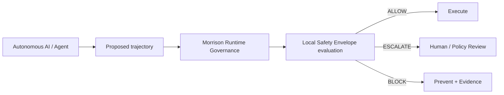
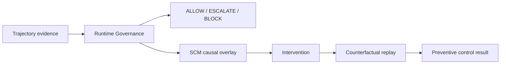
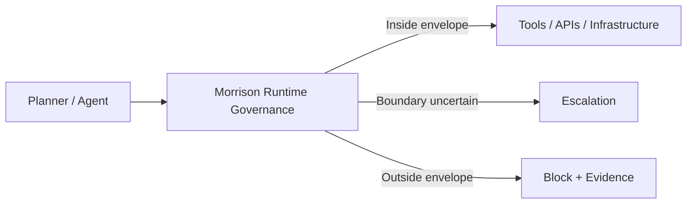

<div align="center">

# Davarn Morrison

**Founder & CEO — Resurrection Tech Ltd · London**

*Local Safety Envelopes for autonomous AI · enforced before execution*

[](https://github.com/davarntrades/Morrison-Runtime-Governance)
[](https://resurrection-tech.com)
[](https://github.com/davarntrades/Morrison-Runtime-Governance)
[](https://github.com/davarntrades/Morrison-Runtime-Governance)
[](https://www.linkedin.com/in/davarn-morrison-14b93b263)
[](https://resurrection-tech.com)

**“Safety is not only what a model says. It is the region in which the deployed system can actually operate.”**

</div>

---

## The Thesis

Autonomous AI is moving from generating answers to **taking actions** across APIs, infrastructure, financial systems, healthcare workflows, security tooling and multi-agent environments.

The important question is no longer only:

> *Is the model safe?*

It is:

> **What does locally safe operation actually look like inside this environment — under these tools, permissions, policies, workflows and reachable states?**

That is the problem I am building Resurrection Tech to solve.

---

## Local Safety Envelopes for Autonomous AI

Safety-critical engineering rarely relies on a vague statement that a system is simply “safe.” It defines an **operating envelope**: the bounded region in which operation remains acceptable, and the conditions under which the boundary has been crossed.

The same principle appears in:

- **Aviation** — flight envelopes define allowable combinations of speed, load, altitude and operating condition.
- **Nuclear engineering** — plants operate within tightly controlled limits around temperature, pressure, cooling, power and system state.
- **Industrial robotics & process control** — systems enforce operating envelopes around motion, force, speed, pressure, temperature and process variables.

I apply that principle to autonomous AI.

> **A local Safety Envelope is the environment-bounded region within which an autonomous system has been evaluated as locally admissible under its actual tools, permissions, policies, workflows and reachable states.**

It is deliberately **not** a universal claim that the underlying model is globally safe.

---

## What I’m Building

I’m building **Morrison Runtime Governance™** at Resurrection Tech: a model-agnostic pre-execution governance layer that maps, tests and enforces the local Safety Envelope between an autonomous AI system and the real systems it can affect.

Every proposed trajectory is evaluated **before execution**.

- If the trajectory remains inside the validated envelope, it can proceed.
- If it approaches an uncertain boundary, it can be escalated.
- If it leaves the envelope, violates a constraint, or enters a configured forbidden region **Ω**, it is blocked before side effects occur.

**ALLOW · ESCALATE · BLOCK**



The planner can change. The model can change. The governance invariant remains external to the model.

---

## Why This Matters

Permissions, prompts and policies do not enforce themselves at the moment an AI system acts.

A sequence can become unsafe even when individual actions appear acceptable in isolation:

- authorised data access → aggregation → prohibited exfiltration
- permitted finance actions → unsafe transfer sequence
- valid healthcare access → PHI exposure or unsafe downstream action
- normal shell commands → privilege escalation or destructive execution
- separately safe multi-agent actions → jointly unsafe outcome

The objective is not merely to classify an output after the fact. It is to know **where safe operation ends before execution crosses the boundary**.

```text
Locally admissible trajectory ⇔ ℛ(t) remains inside the validated Safety Envelope
Forbidden reachability ⇔ ℛ(t) ∩ Ω ≠ ∅
```

Where **ℛ(t)** is the set of reachable states and **Ω** is the configured forbidden region.

---

## What Makes the Approach Different

The positioning is intentionally narrower — and more testable — than broad claims of “AI safety.”

### Environment-specific
The claim is tied to the actual deployment: its tools, permissions, policies, workflows, state and reachable consequences.

### Trajectory-level
Morrison evaluates the path through the system, not only the latest prompt, output or individual tool call.

### Pre-execution
The governance decision happens before the proposed action reaches the real execution surface.

### Bounded evidence
The system records what was evaluated, what was permitted, what was blocked or escalated, and the scope and limitations of the local safety claim.

### Model-agnostic
The governance layer sits outside the model and does not require retraining or access to model weights.

---

## Current Technical Evidence

| Metric | Current state |
|---|---:|
| Governance evaluations | **129,857** |
| Test cases | **171 / 171 passing** |
| Test suites | **18** |
| Current release | **v0.4.1** |
| Runtime posture | **Fail-closed** |
| Governance level | **Pre-execution** |
| Model dependence | **Model-agnostic middleware** |

Validation work spans finance, cybersecurity, healthcare, data privacy and enterprise-system scenarios, including multi-step, delayed-intent, chained-tool and adversarial trajectories.

---

## Enforcement Stack

```text
A_safe ⊂ V₂ ⊂ V₃ ⊂ V₄ ⊂ V₄⁺ ⊂ V₅ ⊂ V₅⁺
```

| Layer | Core question |
|---|---|
| **A_safe** | Is the current step directly forbidden? |
| **V₂** | Is the trajectory drifting toward the Safety Envelope boundary? |
| **V₃** | Is the current trajectory forecast to leave the envelope or reach Ω? |
| **V₄ / V₄⁺** | Does a locally admissible state or trajectory remain constructible? |
| **V₅ / V₅⁺** | Does the local safety property survive perturbation and adversarial assumption attack? |

---

## Causal Analysis Overlay

I am also developing an additive **Structural Causal Model (SCM)-based causal analysis overlay** around Morrison’s canonical trajectory evidence.

The runtime-governance layer remains authoritative for the pre-execution **ALLOW / ESCALATE / BLOCK** decision. The causal overlay asks a different class of questions afterward:

- Why was the Safety Envelope boundary reachable?
- Which variables materially contributed to that reachability?
- What intervention would have broken the trajectory?
- Would Ω still have been reachable if permission, safeguard state, approval or another causal parent had changed?



> **Dynamics asks how the system moved and what became reachable.**  
> **Structural causal modelling asks what would have changed the outcome.**

---

## Information Asymmetry

Alongside the engineering work, I am developing **Information Asymmetry**: a research programme investigating task-relative causal sufficiency — when a representation has compressed away information required for prediction, reconstruction, intervention or accountability.

The working distinction is:

> **Psychological language compresses toward behaviour.**  
> **Dynamical language preserves more of the mechanism.**

The research now connects directly back to runtime governance: not only *is a forbidden state reachable?*, but eventually also *which intervention would have made it unreachable?*

The full research note is in **[Ontology Perturbation: From a Sub-90% Result to a Hybrid Causal Architecture](https://github.com/davarntrades/information-asymmetry/blob/main/ONTOLOGY_PERTURBATION_FROM_SUB90.md)**.

---

## Integration Surface

Morrison is designed to sit at the action boundary across agent frameworks and enterprise workflows, including:

- OpenAI tool/function calling
- Anthropic / Claude tool use
- LangChain / LangGraph-style orchestration
- AutoGen
- MCP
- browser agents
- shell / subprocess execution
- custom enterprise workflows



---

## Current Commercial Focus

I am focused on turning internal technical proof into **external, environment-specific Safety Envelope evidence** through tightly scoped enterprise deployments.

### Best-fit opportunities

- **Safety Envelope Assessment**
- **48-Hour Runtime Governance Audit**
- **Shadow Mode / Limited Pilot**
- **Guarded Pilot**
- **Enterprise Integration**
- **OEM / Technology Alliance integrations**
- regulated or high-consequence autonomous workflows in **cybersecurity, healthcare, finance, critical infrastructure and sovereign environments**

The ideal deployment is a bounded real or sandboxed workflow where an autonomous system has meaningful tool permissions and the organisation wants to answer:

> **What can this system safely reach in our environment — and where should execution stop?**

If that describes your environment, I’m open to a focused technical evaluation or pilot conversation.

---

## Research Direction

My broader work explores a structure-first view of intelligent and autonomous systems:

- local safety as an environment-bounded operating envelope
- intelligence as trajectories through state space
- safety as reachability constraints
- capability as an executable set, not a psychological description
- governance as control over admissible state transitions
- causal sufficiency as task-relative
- dynamical systems combined with structural causal modelling for intervention analysis
- causality and accountability preserved at the execution boundary

This leads to a simple principle:

> **When causal accountability is non-negotiable, describe the system in terms of states, constraints, trajectories and actions — not intentions alone.**

---

## Selected Repositories

- **[Morrison Runtime Governance](https://github.com/davarntrades/Morrison-Runtime-Governance)** — local Safety Envelopes and pre-execution trajectory governance
- **[Information Asymmetry](https://github.com/davarntrades/information-asymmetry)** — causal sufficiency, representation, information loss and intervention-oriented research
- **[Resurrection Tech Enterprise](https://github.com/davarntrades/resurrection-tech-enterprise)** — enterprise deployment and integration infrastructure
- **[Trajectory](https://github.com/davarntrades/Trajectory-Always-On-Executive-Intelligence-)** — always-on executive intelligence system

---

<div align="center">

### Resurrection Tech Ltd

**See the Safety Envelope your AI can actually operate within — in your environment, before actions execute.**

[Website](https://resurrection-tech.com) · [LinkedIn](https://www.linkedin.com/in/davarn-morrison-14b93b263) · [GitHub](https://github.com/davarntrades) · [Email](mailto:davarn@resurrection-tech.com)

</div>
